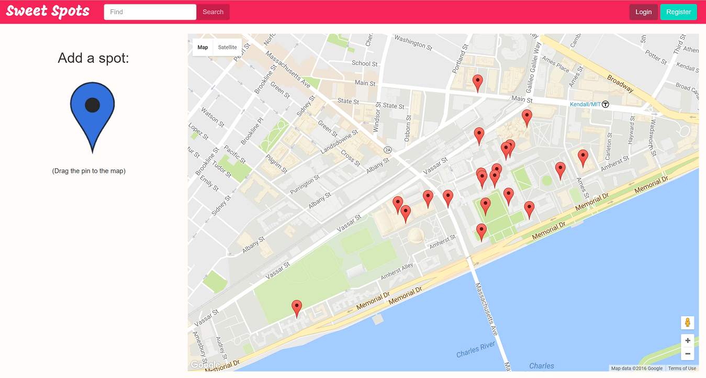

# Sweet Spots

MIT 6.170 Fall 2016 Final Project by Maryam Archie, Nishchal Bhandari, Bob Liang, Isaac Rosado.

## Overview

Sweet Spots is a web application that allows users to map, filter and review points of interest within the MIT campus.

Try our app today!
https://sweet-spots.herokuapp.com/



## Installation
1. Clone the repository and navigate to the root of the repository.

1. Run `npm install` to install the necessary node modules.

1. In a separate terminal window, open `mongod`.

1. Run `npm start` to build the project and create a local server.

1. Navigate to `localhost:3000` in your favorite browser to open the main page.

1. At the main page, you can interact with the map and search for Spots. After completing a search, changing the map bounds constrains the search to a location.

1. In order to add or review a Spot, you need to be signed in. If you already have an account, Click the Login button or navigate to `localhost:3000/login` to reach the login page. 
Otherwise, click the Register button or navigate to `localhost:3000/register` to register. You need an MIT email address in order to complete registration.

1. Login using your email and password.

1. Once logged in, you can add spots. Do this by dragging the big marker onto the map.

1. You can also post reviews for spots, upvote and downvote other people's reviews, and favorite spots you like!

## Testing
1. Ensure that you've run `npm install` in the root directory.

2. Run `npm test` to run the functional (routes) and unit (model) tests.
Because we seed the database with Tags in `app.js`, we need to `require` it in the tests. As a result, please ignore the following errors:
```
ERROR in multi main
Module not found: Error: Cannot resolve 'file' or 'directory' ./react/main.js in <path_to>\tests\model_tests
 @ multi main
```

## Documents
+ ProjectDesign.pdf - Contains information about the concepts, data model and security of the project.
+ [Final Presentation](https://docs.google.com/presentation/d/1PabaAdRTmYSmqBgYco62rbZK26PoYPYDz8GuAeHlPXE/edit?usp=sharing)

Disclaimer: This has only been tested with Google Chrome.
